# Работа "Защищенный контур"

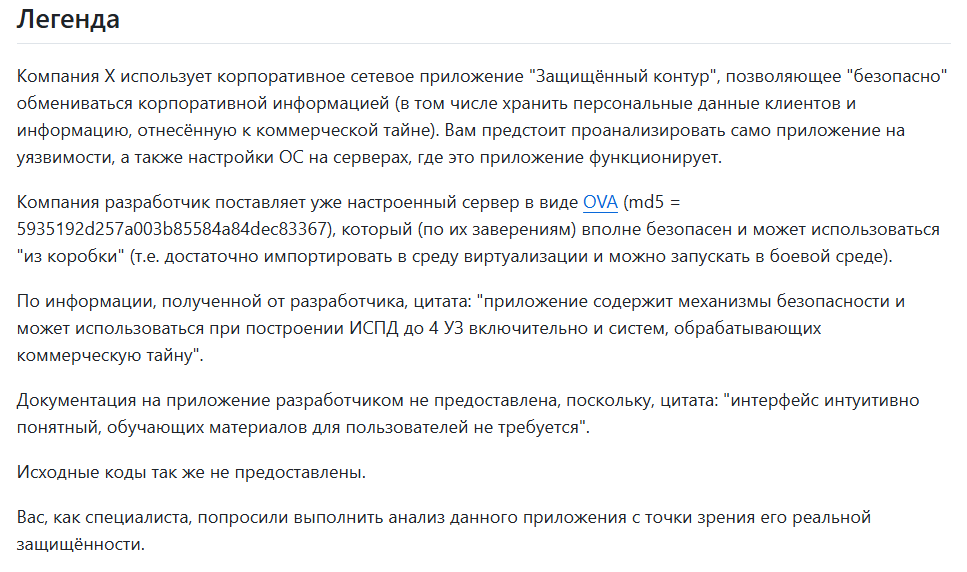

#### Задача:

Подготовить отчет о:

Найденных несоответствиях системы требованиям нормативных документов*.

Найденных "слабостях" (которые могут привести к уязвимостям) и предложение по необходимым мерам для их устранения (если такие меры возможно 
принять).

Формат отчета - свободный.

_*в части документов нужно:_

_ПДн: реализация мер по обеспечению безопасности в части ИАФ, УПД_

_КТ: "разрешение или запрет доступа к информации, составляющей коммерческую тайну" посредством механизмов разграничения доступа, встроенных в_ 
_приложение (механизмы ОС и сторонних сервисов рассматривать не нужно)_

## Отчет

#### I. Нормативная база

В соответствии с Приказом ФСТЭК России от 18.02.2013 № 21 (далее - Приказ), для ИСПДн 4 УЗ актуальны требования идентификации и аутентификации субъектов доступа и 
объектов доступа (ИАФ):

- 	ИАФ.1 | Идентификация и аутентификация пользователей, являющихся работниками оператора.
-	ИАФ.3 | Управление идентификаторами, в том числе создание, присвоение, уничтожение идентификаторов.
-	ИАФ.4 | Управление средствами аутентификации, в том числе хранение, выдача, инициализация, блокирование средств аутентификации и принятие мер в случае утраты и (или) компрометации средств аутентификации.
-	ИАФ.5 | Защита обратной связи при вводе аутентификационной информации.
-	ИАФ.6 | Идентификация и аутентификация пользователей, не являющихся работниками оператора (внешних пользователей).
-	УПД.1 | Управление (заведение, активация, блокирование и уничтожение) учетными записями пользователей, в том числе внешних пользователей.
-	УПД.2 | Реализация необходимых методов (дискреционный, мандатный, ролевой или иной метод), типов (чтение, запись, выполнение или иной тип) и правил разграничения доступа.
-	УПД.3 | Управление (фильтрация, маршрутизация, контроль соединений, однонаправленная передача и иные способы управления) информационными потоками между устройствами, сегментами информационной системы, а также между информационными системами.
-	УПД.4 | Разделение полномочий (ролей) пользователей, администраторов и лиц, обеспечивающих функционирование информационной системы.
-	УПД.5 | Назначение минимально необходимых прав и привилегий пользователям, администраторам и лицам, обеспечивающим функционирование информационной системы.
-	УПД.6 | Ограничение неуспешных попыток входа в информационную систему (доступа к информационной системе).
-	УПД.13 | Реализация защищенного удаленного доступа субъектов доступа к объектам доступа через внешние информационно-телекоммуникационные сети.
-	УПД.14 | Регламентация и контроль использования в информационной системе технологий беспроводного доступа.
-	УПД.15 | Регламентация и контроль использования в информационной системе мобильных технических средств.
-	УПД.16 | Управление взаимодействием с информационными системами сторонних организаций (внешние информационные системы).

В соответствии с Федеральным законом от 29.07.2004 N 98-ФЗ «О коммерческой тайне» обладатель информации, составляющей коммерческую тайну вправе разрешать или запрещать доступ к информации, составляющей коммерческую тайну, определять порядок и условия доступа к этой информации.

#### II. Недостаточная защита и управляемость учетными данными пользователей.

1. Недостаточная управляемость учетными данными пользователей:

- Отсутствует многофакторная аутентификация, в качестве единственного фактора аутентификации используется пароль; 
- Не реализована возможность смены пароля пользователем;
- Отсутствует функционал принудительной смены/сброса пароля администратором;
- Отсутствует возможность блокирования и изменения учетной записи (далее - УЗ), администратору доступны только создание и удаление УЗ;
- Не предусмотрена возможность изменения роли после создания УЗ;

Таким образом, нарушены требования Приказа в части требований для ИСПДн 4 УЗ, а именно ИАФ.4, ИАФ.6, УПД.1.

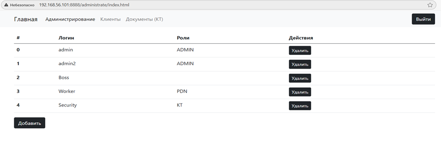

Связанные уязвимости:

- CWE-308: Use of Single-factor Authentication;

Риск:

Использование пароля в качестве единственного фактора аутентификации увеличивает вероятность несанкционированного доступа в случае компрометации учетных данных, отсутствие механизмов управления учетными записями лишает возможности своевременного и корректного реагирования на инциденты безопасности.

Рекомендации:

- Рассмотреть возможность внедрения дополнительного фактора(ов) аутентификации, как минимум для привилегированных пользователей;
- Реализовать возможность смены пароля пользователем;
- Предоставить администратору возможность блокирования и изменения учетных записей;
- Ограничить время жизни пароля, обеспечив его регулярное изменение;
- Обеспечить надежное хранение паролей в необратимом состоянии.

2. Пароль при пользовательском вводе не скрыт, что является несоответствием требованию ИАФ.5 Приказа.

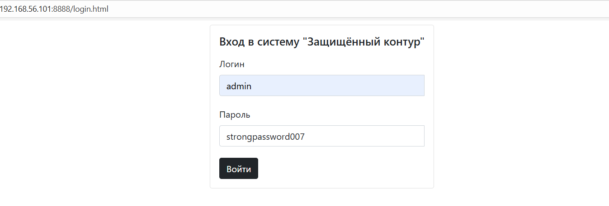

Связанные уязвимости:

- CWE-549: Missing Password Field Masking.

Риск:

Отображение пароля в открытом виде при пользовательском вводе повышает риск его компрометации в том числе посредством визуального наблюдения, записи экрана либо перехвата средствами удаленного доступа, в результате чего злоумышленник может получить учетные данные пользователя без необходимости перебора или взлома.

Рекомендации:

- Исключить отображение пароля в открытом виде. 

3. Выявлено отсутствие минимальных требований безопасности к паролю, допускается создание пароля длиной в один символ.

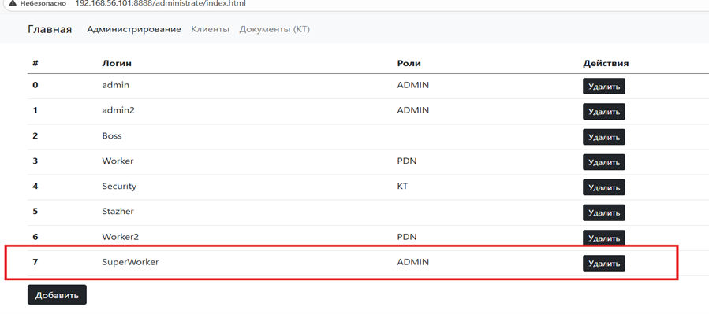

Связанные уязвимости:

- CWE-521: Weak Password Requirements.

Риск:

Отсутствие требований к сложности и длине пароля позволяет использовать легко угадываемые и тривиальные пароли, значительно повышая вероятность успешного подбора учетных данных, что в сочетании с однофакторной аутентификацией приведет к несанкционированному доступу.

Рекомендации:

- Установить минимальную длину пароля;
- Ограничить возможность использования тривиальных паролей;
- Использовать смешанный набор символов (буквы разного регистра, цифры, символы);
- Ограничить возможность повторного использования пароля;
- Реализовать проверку сложности и уникальности пароля на стороне сервера.

4. Отсутствует ограничение неуспешных попыток входа в нарушение требования УПД.6 Приказа.

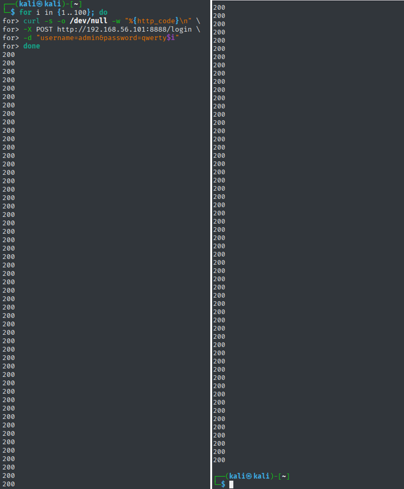

Связанные уязвимости:

- CWE-307: Improper Restriction of Excessive Authentication Attempts.

Риск:

Отсутствие ограничения неуспешных попыток входа позволяет проводить неограниченный перебор паролей без риска блокировки учетной записи. В сочетании с отсутствием требований к сложности пароля и однофакторной аутентификации это существенно увеличивает вероятность успешной компрометации учетных записей.

Рекомендации:

- Реализовать ограничение количества попыток входа;
- Реализовать ограничение времени между попытками входа;
- Применять блокировку учетной записи при превышении допустимого количества попыток входа;
- Фиксировать события неуспешной аутентификации в журналах.

#### III. Отсутствие идентификации и недостаточное журналирование событий.

1. Отсутствует уникальный идентификатор учетной записи. Допускается создание нескольких учетных записей с одинаковыми учетными данными, при этом возможен выбор различных ролей. Ролевая модель формально реализована, но роль не имеет жесткой связи с субъектом доступа. При авторизации выбирается последняя по времени создания учетная запись. Требования ИАФ.1, ИАФ.3, УПД.2, УПД.4, УПД.5 Приказа не реализованы. Фактически в системе отсутствует механизм однозначной идентификации субъекта доступа, что делает невозможным корректную реализацию ролевой модели и контроля полномочий.

Создание пользователя:

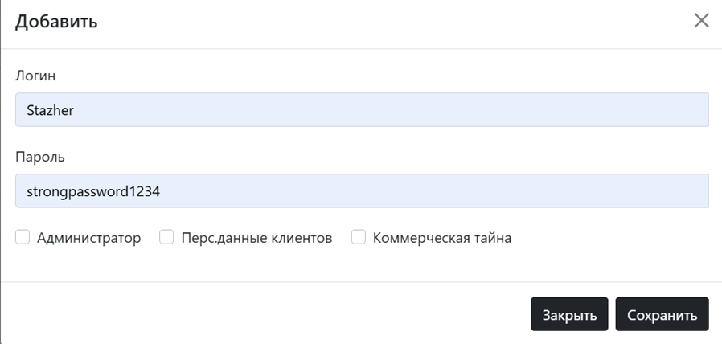

Интерфейс созданного пользователя:

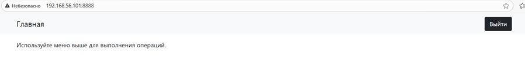

Создание пользователя с идентичными учетными данными и повышенными привилегиями:

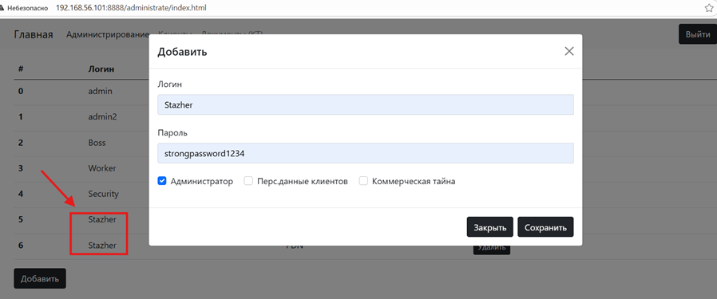

Пользователь авторизован в роли "ADMIN", соответствующей последней по времени создания учетной записи:

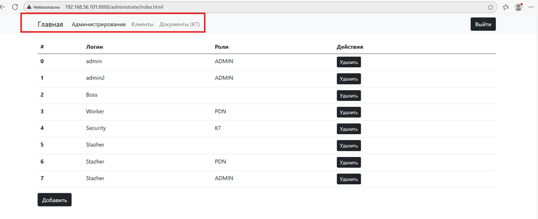

Связанные уязвимости:

- CWE-1390: Weak Authentication.

Риск:

Отсутствие надежной идентификации субъекта доступа может привести к неконтролируемому получению привилегий, нарушению ролевой модели и несанкционированному доступу к функциям и данным системы, что создает предпосылки для компрометации информации и нарушения требований законодательства.

Рекомендации:

- Обеспечить присвоение пользователям идентификаторов, обладающих свойствами уникальности, устойчивости и управляемости;
- Реализовать хранение, управление, валидацию и контроль уникальности идентификаторов на стороне сервера.

1. Приложение не осуществляет запись журналов в отдельные файлы, журналируемые события выводятся в стандартные потоки stdout/stderr и агрегируются службой journald. В журналируемых событиях (journalctl) отсутствуют сведения, позволяющие однозначно идентифицировать субъекта доступа и его роль. В качестве единственного атрибута, фиксируемого в журнале событий, выступает IP-адрес источника соединения, не являющийся идентификатором пользователя, поскольку не обладает свойствами уникальности, устойчивости и управляемости. Логирование реализовано на уровне технических HTTP-событий(метод, URL, IP-адрес источника, дата и время запроса) и прикладных ошибок системы.

Связанные уязвимости:

- CWE-223: Omission of Security-relevant Information;
- CWE-778: Insufficient Logging.

Риск:

Отсутствие журналирования сведений, необходимых для оценки безопасности действий, а также выявления событий безопасности, в сочетании с отсутствием уникальных идентификаторов субъектов доступа исключает возможность своевременного выявления инцидентов безопасности, их расследования и реагирования, а также делает невозможным установление ответственности за совершенные действия.

Рекомендации:

- Реализовать прикладное журналирование событий безопасности, ошибок, исключений, аутентификации, авторизации и действий пользователей(успешные и неуспешные попытки аутентификации, операции создания, изменения и удаления учетных записей, управления объектами коммерческой тайны, действия привилегированных пользователей, операции доступа к чувствительным данным и критическим функциям приложения);
- Обеспечить фиксацию уникального идентификатора пользователя, его роли, а также результата выполнения операции (успешно/ошибка) для каждого значимого события;
- Разделить технические и пользовательские логи;
- Обеспечить централизованное хранение журналов либо их передачу в специализированные системы анализа и корреляции событий безопасности (SIEM);
- Обеспечить сохранность журналов и невозможность их изменения и удаления со стороны пользователей и администраторов приложения;
- Обеспечить хранение журналов в течение регламентированного срока, достаточного для выявления и расследования инцидентов информационной безопасности.

#### IV. Незащищенная передача чувствительных данных и отсутствие управления информационными потоками.

1. Взаимодействие с приложением устанавливается по протоколу HTTP без использования защищенного канала связи. Учетные данные пользователей, персональные данные клиентов, а также сведения о действиях пользователей в веб-интерфейсе приложения при работе с файлами, содержащими коммерческую тайну, включая метаданные и операции управления, передаются в открытом виде и доступны для перехвата. Кроме того, перехватываются вспомогательные клиентские скрипты и авторизационные куки, что облегчает анализ логики приложения и увеличивает поверхность атаки.

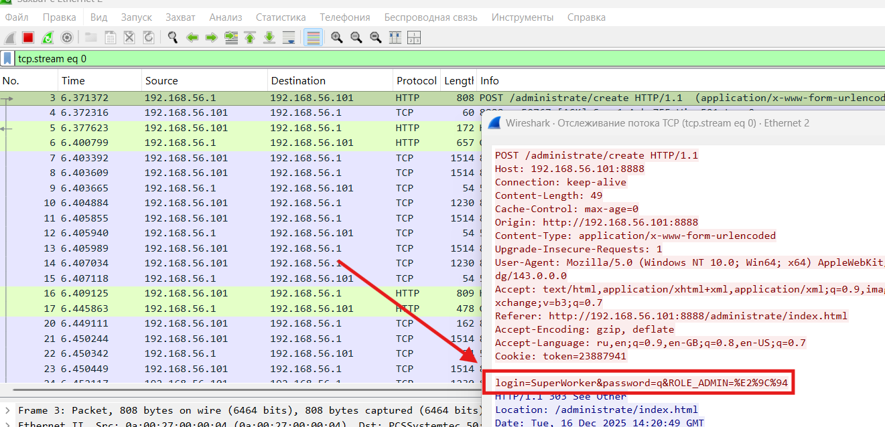

Связанные уязвимости:

- CWE-319: Cleartext Transmission of Sensitive Information;
- CWE-523: Unprotected Transport of Credentials.

Риск:

Передача чувствительных данных в открытом виде позволяет злоумышленнику получить учетные данные пользователей и персональные данные клиентов без необходимости эксплуатации уязвимостей приложения, что может привести к компрометации учетных записей и сессионных идентификаторов, утечке ПДн и дальнейшему развитию атаки, в том числе утечке, уничтожению или модификации коммерчески значимой информации.

Рекомендации:

- Обеспечить защиту сетевых соединений, используемых для передачи учетных данных, персональных данных, коммерческой тайны и иной чувствительной информации, с применением криптографических механизмов, обеспечивающих конфиденциальность и целостность данных (например, TLS), либо иных эквивалентных мер защиты.

2. Доступ к разделу приложения, предназначенному для работы с информацией, отнесенной к коммерческой тайне, возможен без прохождения процедур идентификации и аутентификации. При прямом обращении к URL соответствующего раздела пользователь, не прошедший аутентификацию, получает доступ к функционалу управления объектами, содержащими коммерческую тайну, а именно удаление существующих и загрузку новых файлов. Функционал скачивания файлов при этом недоступен. Ограничения на тип, содержимое, размер и именование загружаемых файлов отсутствуют, что позволяет загрузить произвольные файлы, включая исполняемые, а также провести атаки на отказ в обслуживании. Таким образом, выявлено несоответствие требованиям УПД.3 Приказа, а также Федерального Закона N 98-ФЗ "О коммерческой тайне" в части отсутствия мер по ограничению доступа.

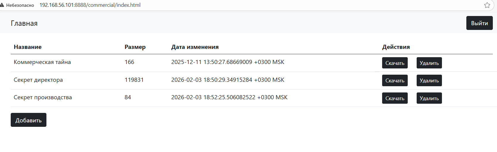

Удаление файла "Секрет Директора" и загрузка исполняемого файла с аналогичным именем:

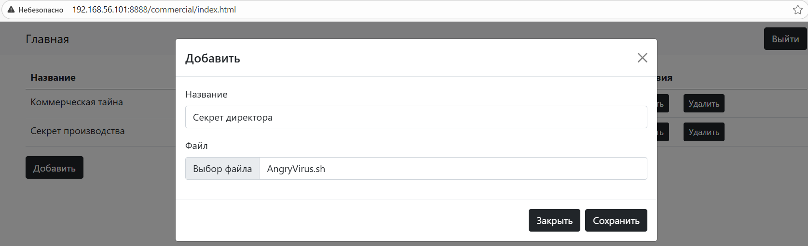

Исполняемый файл загружен на сервер с владельцем root:

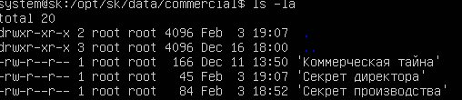

Исчерпание дискового пространства в результате загрузки больших файлов (Все последующие загружаемые файлы обрезаются до нулевой длины):

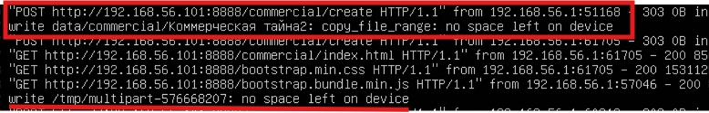

Связанные уязвимости:

- CWE-306: Missing Authentication for Critical Function;
- CWE-434: Unrestricted Upload of File with Dangerous Type;
- CWE-400: Uncontrolled Resource Consumption.

Риск:

Отсутствие контроля и управления доступом к функционалу работы с коммерческой тайной позволяет неаутентифицированному пользователю выполнять критические операции с объектами системы, такие как: удаление или подмена файлов содержащих коммерческую тайну, неконтролируемая загрузка произвольных файлов с последующим использованием их в атаках. Совокупность данных факторов создает предпосылки для выполнения произвольного кода с привилегиями root, исчерпания дискового пространства и отказа в обслуживании. Уязвимость имеет критический уровень опасности, так как несет риск нарушения конфиденциальности, целостности и доступности информации.

Рекомендации:

- Реализовать обязательную идентификацию и аутентификацию пользователей для доступа к функционалу управления объектами, содержащими коммерческую тайну;
- Ограничить доступ к данному функционалу на основе ролевой модели и принципа минимально необходимых привилегий;
- Реализовать серверную валидацию загружаемых файлов, включая: проверку типа и содержимого файлов, ограничения на размер, контроль допустимых имен;
- Исключить возможность загрузки и хранения файлов с избыточными привилегиями;
- Реализовать контроль использования дискового пространства и защиту от отказа в обслуживании.

#### V. Небезопасное хранение и использование криптографических ключей и отладочной информации.

В результате анализа бинарного файла приложения с использованием инструментов strings, strace, cutter-rizin обнаружена отладочная информация, включая имена функций и пути к исходным файлам. В исполняемом коде жестко зашиты криптографический ключ и nonce, используемые для шифрования файлов данных.

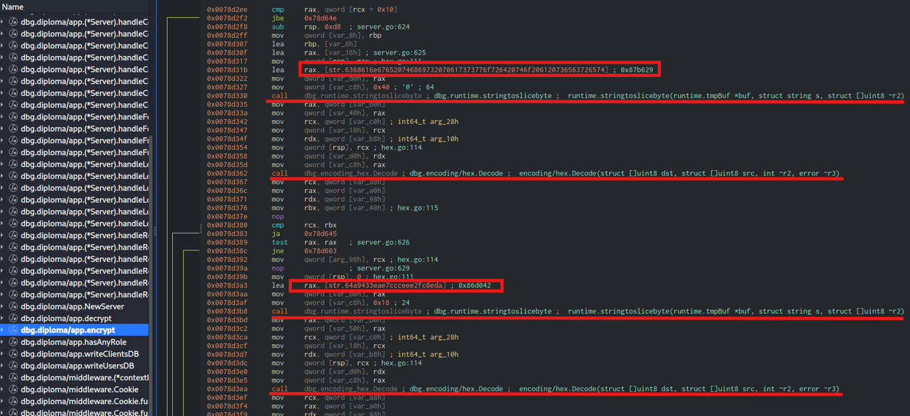

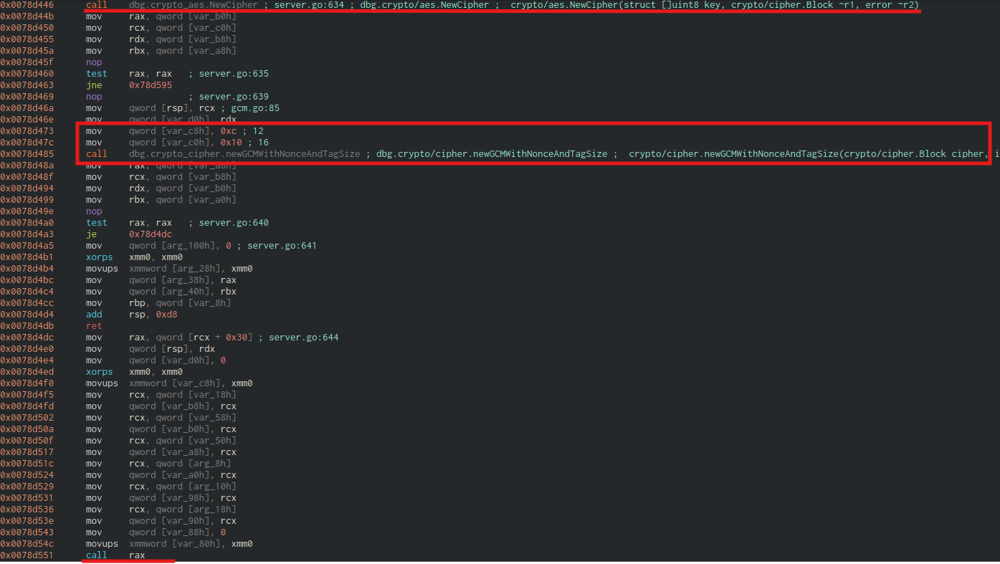

На основании извлеченного ключевого материала реализован дешифратор, позволяющий расшифровать содержимое файлов данных, защищенных средствами приложения:

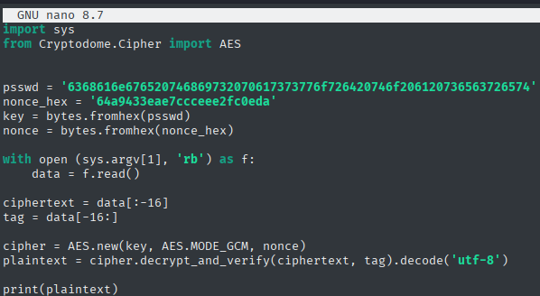

В расшифрованных данных обнаружена действующая учетная запись с привилегиями root, отсутствующая в пользовательском интерфейсе приложения, что свидетельствует о наличии скрытой учетной записи. Для данной учетной записи используется статический тривиальный пароль, не соответствующий базовым требованиям к сложности и устойчивости к подбору.

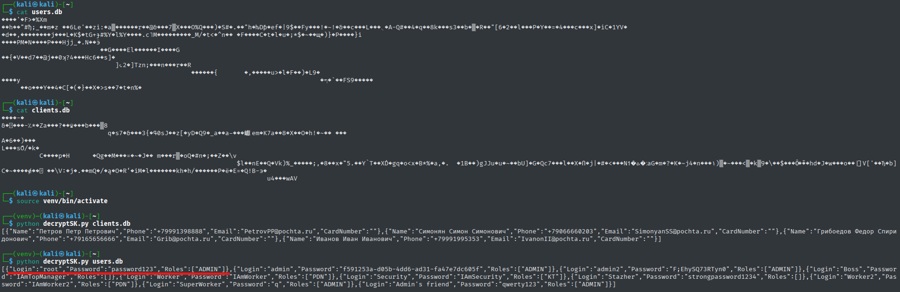

Связанные уязвимости:

- CWE-321: Use of Hard-coded Cryptographic Key;
- CWE-489: Active Debug Code;
- CWE-912: Hidden Functionality.

Риск:

Жестко заданный криптографический ключ в сочетании с наличием отладочной информации в бинарном файле приложения несет риск компрометации защищаемых файлов данных. При условии доступа к файловой системе злоумышленник, получив доступ к исполняемому файлу приложения, может расшифровать защищенные данные, включая учетные данные пользователей и персональные данные клиентов. Наличие неучтенной скрытой учетной записи с привилегиями root, в сочетании со слабым паролем, отсутствием защиты от перебора и дополнительных факторов аутентификации, создает риск компрометации данной учетной записи и последующего скрытого присутствия злоумышленника в системе.

Рекомендации:

- Провести аудит всех криптографических механизмов приложения на предмет корректности реализации и соответствия требованиям безопасности;
- Исключить использование жестко зашитых криптографических ключей и иных чувствительных данных в исполняемом коде приложения;
- Реализовать безопасное управление ключевым материалом, включая генерацию, хранение и ротацию ключей с использованием специализированных механизмов управления ключами;
- Исключить включение отладочной информации в продуктовые сборки приложения;
- Обеспечить учет и контроль всех учетных записей, включая служебные и административные.

#### VI. Заключение

В ходе анализа веб-приложения выявлены системные несоответствия требованиям нормативных документов в части идентификации и аутентификации (ИАФ), управления правами доступа (УПД), а также реализации механизмов ограничения доступа к информации, составляющей коммерческую тайну. Установлено отсутствие обязательных механизмов идентификации субъектов доступа, управления учетными записями, защиты аутентификационной информации, журналирования событий безопасности и разграничения доступа к функционалу работы с коммерческой тайной.

Выявленные недостатки нарушают требования Приказа ФСТЭК России № 21 для ИСПДн 4 УЗ, а также положения Федерального закона N 98-ФЗ «О коммерческой тайне» в части обеспечения разрешительного порядка доступа к информации. Совокупность уязвимостей создает риски несанкционированного доступа к персональным данным и информации, составляющей коммерческую тайну, нарушения конфиденциальности, целостности и доступности данных, а также компрометации учетных записей, включая привилегированные.